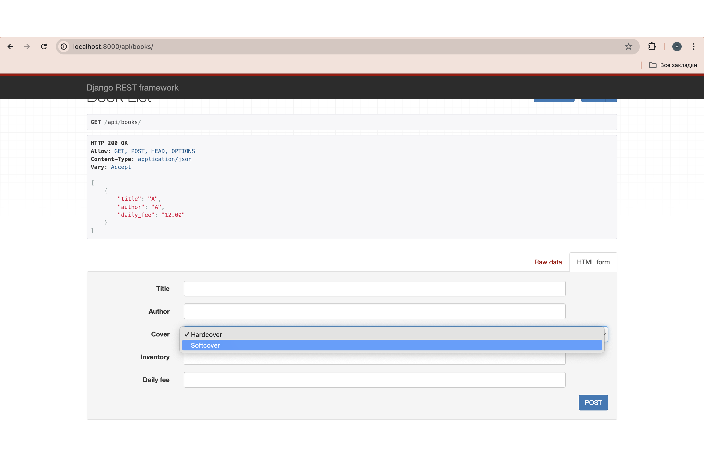
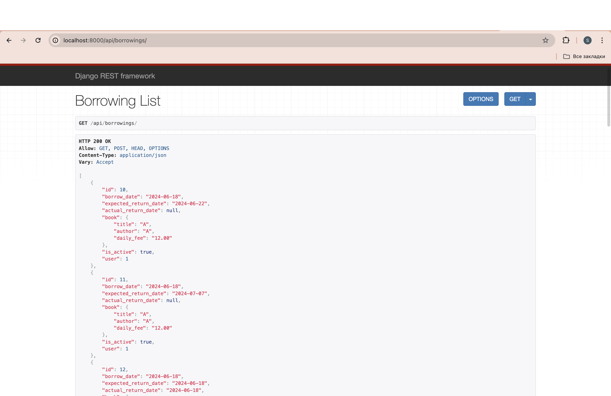
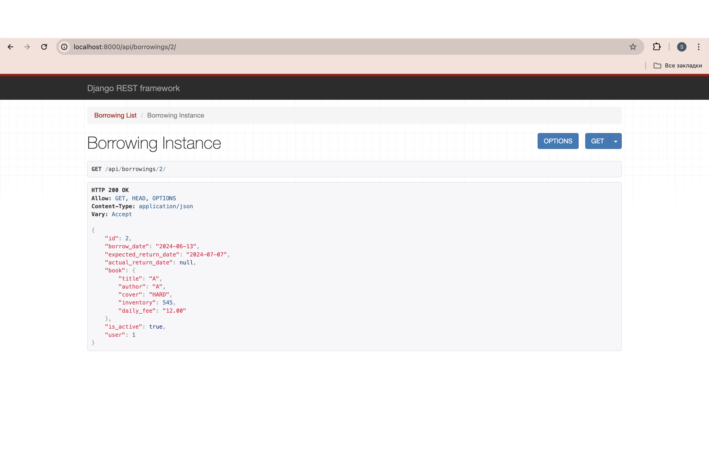
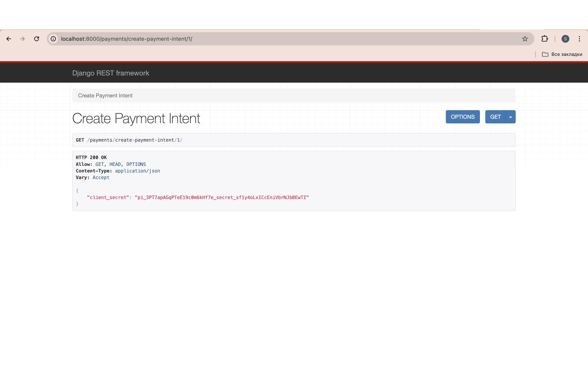

# Library Service API

- Book database
- Track of book instances
- Borrowing functionality
- Filtering and other minor functionality
- Scheduled automated telegram notifications
- Implemented payment service
- Extended functionality for users with admin rights
- JWT auth

## Screenshots:

